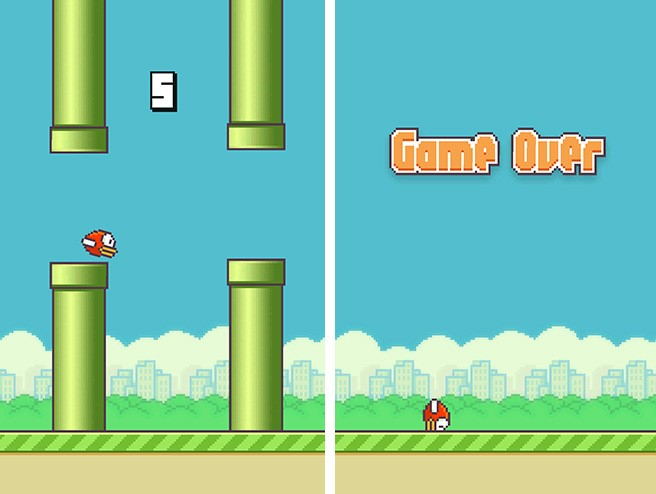

# Flappy-Bird
 Flappy Bird Game - Android Project 
This repository contains the source code for a Flappy Bird game developed using Java and LibGDX framework for Android Studio. The game features a classic side-scrolling gameplay where the player controls a bird that navigates through pipes by tapping on the screen
<h1>Technologies used</h1>
Java 
LibGDX

<h1>Key Features</h1>
Classic Flappy Bird gameplay mechanics 
Simple tap-based controls 
Scoring system to keep track of the player's progress 
Game over screen with replay option 

<h1>Project Setup</h1>
To get started with the project, follow these steps: 
1-Clone the repository to your local machine 
2-Open the project in Android Studio 
3-Resolve Dependencies 
4-Build the project 
5-Run the project 

